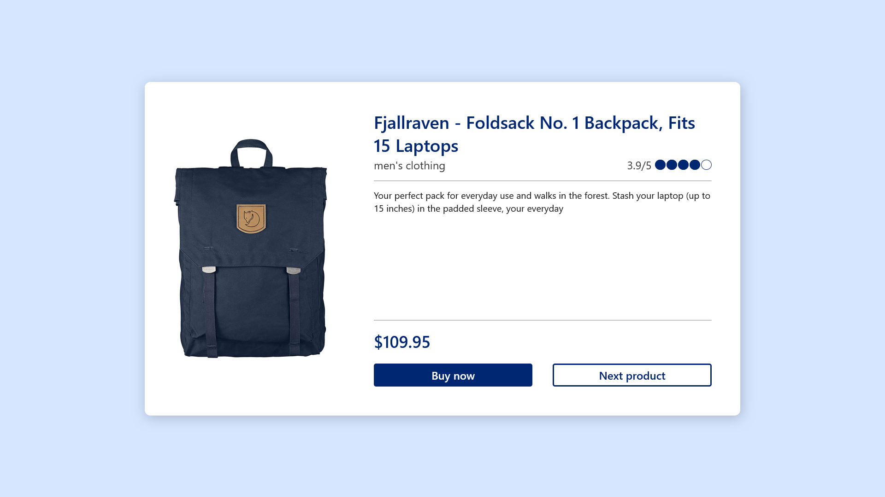

# e-Commerce Catalog

This is a solution to the final task of project-based virtual internship from Core Initiative x Rakamin Academy. This final task is required to complete the virtual internship.

## Overview

This page shows the data from API https://fakestoreapi.com that the categories are men's clothing and women's clothing, otherwise, the page will show that the product is unavailable. Users should be able to change the product displayed by clicking the next product button. For the friendlier user experience, loader element will be shown when waiting for response from the API.

## Screenshot

## Link

- Live Site URL: [Github Pages](https://rachmatilham.github.io/ecommerce-catalog/)

## Built with

- Semantic HTML5 markup
- CSS custom properties
- Flexbox
- [Vue.js](https://vuejs.org) - JS Framework
- [Vite](https://vitejs.dev/) - Frontend build tooling

## Author

- Github - [Rachmat Ilham Maulana](https://github.com/rachmatilham)
- LinkedIn - [Rachmat Ilham Maulana](https://www.linkedin.com/in/rachmatilham)
